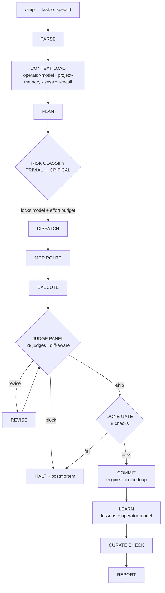

# claude-ship

[](https://github.com/shadybad/claude-ship/actions/workflows/ci.yml)
[](./LICENSE)
[](./.python-version)
[](https://claude.ai/code)

A 14-step ship pipeline for [Claude Code](https://claude.ai/code). Takes a fuzzy goal → crisp spec → risk-classified plan → reviewed diff → engineer-in-the-loop commit → captured lessons. Packaged as an installable Claude Code plugin.

> Status: v0.1.1 — extracted from a personal config and hardened with a structure test suite + CI. Works as-is. Names and project namespaces are pre-set for the original author; see [CONFIG.md](./CONFIG.md) to personalize.

## Why

Agentic coding fails in predictable ways: shipping the wrong thing well, skipping review on "small" changes, burning tokens routing every subagent result through one context, and learning nothing from failures. `claude-ship` is the guardrail layer — a single `/ship` command that scopes the work, scales review to risk, keeps a human in the loop on every commit, and feeds lessons back into itself. It's also a working reference for several patterns from Anthropic's [multi-agent research system](https://www.anthropic.com/engineering/built-multi-agent-research-system): per-tier effort budgets, structured delegation briefs, an artifact-reference protocol, and long-horizon hand-off.

## Architecture

`/ship` is the conductor. Every step delegates to a skill; the skills compose into one pipeline with two feedback loops (judge → revise, and commit → learn).



Risk tier is the central lever: it locks the model each subagent and judge runs on (Haiku → Sonnet → Opus), caps the effort budget, and selects which judges fire. A diff-aware pre-pass narrows the judge set to the concern categories the diff actually touches.

## Demo

`claude-ship` validates its own structure — the walkthrough below runs the real test + lint suite green. Generate it locally with `vhs demo/demo.tape` (see [demo/](./demo/README.md)).

<!-- Uncomment once demo/claude-ship.gif is recorded (run: vhs demo/demo.tape): -->
<!--  -->


## What you get

**7 commands** (`/ship` has three forms)

| Command | What it does |
|---------|--------------|
| `/ship "<task>"` | 14-step orchestrator: parse → context → plan → risk → dispatch → MCP route → execute → judges → revise → done-gate → commit → learn → curate → report. |
| `/ship <spec-id>` | Consume an approved spec from `/spec`. |
| `/ship resume` | Resume the last interrupted /ship session. |
| `/spec` | Turn a fuzzy goal into a `/ship`-consumable spec (draft → approved → shipped). |
| `/postmortem` | Failure-side learning loop. Auto-fires on `/ship` halt. |
| `/morning` | Daily kickoff brief (read-only). |
| `/eod` | End-of-day wrap (gated writes). |
| `/weekly` | Sunday review + cross-project pattern detection. |
| `/cross-learn` | Promote patterns learned in one project namespace into system-level rules. |

**12 skills** (orchestrated by the commands above)

`spec-builder`, `judge-panel`, `done-gate`, `commit-protocol`, `project-memory`, `session-recall`, `operator-model`, `mcp-router`, `notion-bridge`, `skill-curator`, `postmortem`, `plugin-packager`.

**3 hooks** (proposal surfacing — see [hooks/README.md](./hooks/README.md))

`proposal-watcher.sh` (SessionStart banner), `composed-statusline.sh` (📋 N indicator), `proposal-count.sh` (helper). Surfaces pending skill-curator proposals on session start and in the statusline.

## Tested

The plugin's structure is enforced by a pytest suite that runs in CI — manifest integrity, skill/command frontmatter, the judge-panel roster count, doc-link resolution, and hook executability. Drift fails the build instead of shipping.

```bash
uv sync && uv run pytest
```

See [CONTRIBUTING.md](./CONTRIBUTING.md) for what each test enforces.

## Install

### Option A — local plugin (immediate)

```bash
git clone https://github.com/shadybad/claude-ship.git ~/.claude/plugins/local/claude-ship
```

Or symlink from anywhere:

```bash
git clone https://github.com/shadybad/claude-ship.git ~/repos/claude-ship
mkdir -p ~/.claude/plugins/local
ln -s ~/repos/claude-ship ~/.claude/plugins/local/claude-ship
```

Restart Claude Code. `/ship` should now be available.

### Option B — drop directly into `~/.claude/`

If you don't want the plugin layer:

```bash
git clone https://github.com/shadybad/claude-ship.git /tmp/claude-ship
cp -i /tmp/claude-ship/.claude/commands/*.md ~/.claude/commands/
cp -ri /tmp/claude-ship/.claude/skills/* ~/.claude/skills/
```

See [INSTALL.md](./INSTALL.md) for the full options matrix.

## Personalize

The skills reference the original author's name and project namespaces (`auto-co`, `margin-invest`, `personal`). To swap them for your own:

```bash
./scripts/personalize.sh "<your-name>" "<project-1>" "<project-2>"
```

See [CONFIG.md](./CONFIG.md) for what gets rewritten and why.

## Recommended companions

`/ship` degrades gracefully when these aren't installed, but works best with:

- `superpowers` marketplace plugins (`brainstorming`, `writing-plans`, `subagent-driven-development`, `episodic-memory`, `private-journal-mcp`)
- `claude-plugins-official` (`plugin-dev`, `commit-commands`, `pr-review-toolkit`, `hookify`, `pyright-lsp`, `notion`, `github`)
- `caveman` marketplace (token compression)
- `ecc` marketplace (29-judge roster source)

The skills name these plugins explicitly — install what you need.

## License

MIT — see [LICENSE](./LICENSE).
